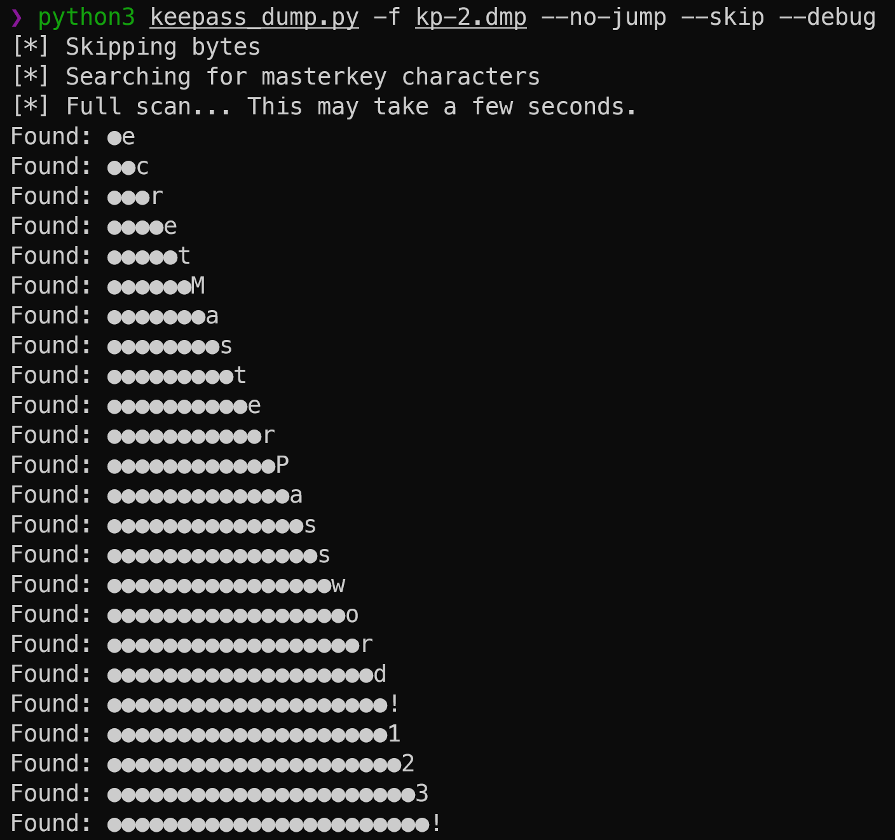
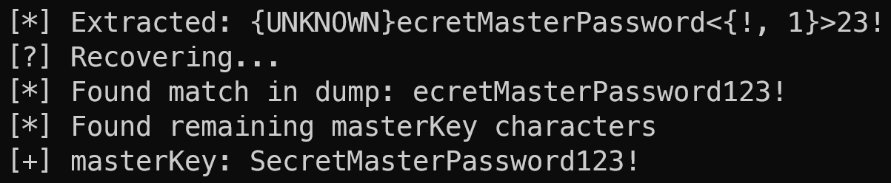
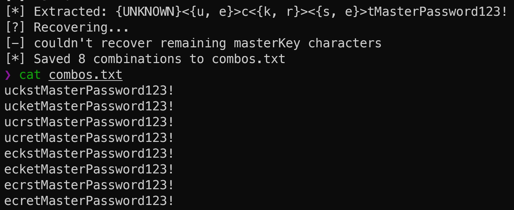
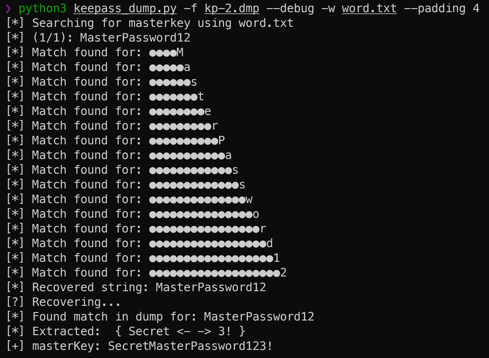
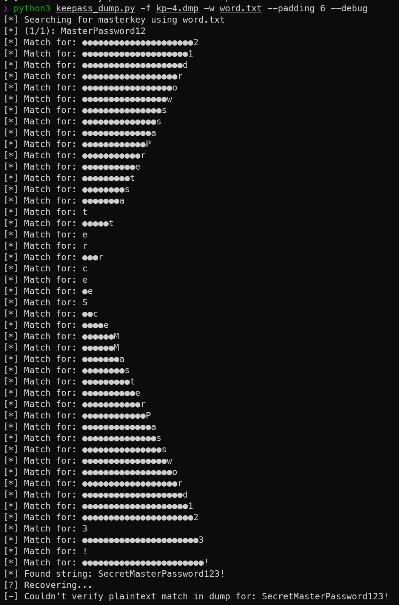

# Keepass-Dumper

This is my PoC implementation for [CVE-2023-32784](https://cve.mitre.org/cgi-bin/cvename.cgi?name=CVE-2023-32784)

My version is a python port of [@vdohney's PoC](https://github.com/vdohney/keepass-password-dumper) along with a few changes and additional features.

## Changes

#

One change, was to use known strings that can be found within the dump file in order to more accurately jump to the location of the masterkey characters. This results in less false positive characters and greatly reduces the amount of time it takes to scan the file. In the case the the strings aren't found in the dump file, the scan will start from the beginning. This option is enabled by default, but if you want to do a full scan instead, you can use `--full-scan`. For these instances, I've also added a `--skip` flag to help speed up the scan. This is done by offsetting the pointer to jump over the the next 1000 bytes as they typically just contain same character repeated multiple. For example, if the character `●e`, was found in the dump file, it would appear like the following:

```
●e
●e
●e
●e
●e
●e
●e
●e
●e
●e
●●c
```

Using the `--skip` flag, it's possible to jump over these repeated bytes to help speed up the scan, although this isn't necessary when using the jump points.

```
[*] 15567777 | Found: ●e
[*] 15568797 | Found: ●e
[*] 15570355 | Found: ●●c
[*] 15571375 | Found: ●●c
[*] 15572925 | Found: ●●●r
[*] 15573973 | Found: ●●●r
```



## Features

#

This version includes a recovery functionality which attempts to find any remaining unknown characters for the key. This is done by trying to locate the different posssible combinations of the characters found inside the dump, if a match is found, the remaining characters are pulled from the dump until the next nonascii character is found.

This works if the **full** plaintext password is stored within the dump file (this seems to happen when user displays the masterkey by deactivating hiding using asterisks).

You can enable this behavoir using the `--recover` flag.



#

You can also specify an ouput file using `-o` to export the different combinations found. Here you can see, even in the case where characters for another masterkey were found, along with the plaintext password not being stored in the dump, in the combo list we're still able to obtain **23/24** characters for the key in the final combination found below.



In this case, the first entry also actually shows `4/5` characters for the second key, `ducks`, that was inside the dump as well, however it was paired together with the characters for the other key resulting in `ucks`|`tMasterPassword123!`. There seems to potentially be a workaround for this, however it's still a WIP.

#

I've also added the ability to search for potential passwords inside the dumpfile by providing a wordlist with `-w`. This flag will generate strings containing characters from the words found in the list to search for within the dump file. You can also specify padding for the strings created using the `-p` or `--padding` flags.

Example: `--padding 2` => ●●a | `--padding 3` => ●●●a



For the example above, the password was stored in plaintext within the dump. So it was possible to match the string found to pull the additional characters. However, in the case that the plaintext password is not stored in plaintext within the dump, it's still possible to extracting the remaining the remaining characters:



In this case, even though it wasn't able to find a plaintext match in the dump, it was still able to extract all the additional characters.

## References

#

Credit to [@vdohney](https://github.com/vdohney) who originally discovered this vulnerability Link to their project is [here](https://github.com/vdohney/keepass-password-dumper)

CVE details: [CVE-2023-32784](https://cve.mitre.org/cgi-bin/cvename.cgi?name=CVE-2023-32784)
